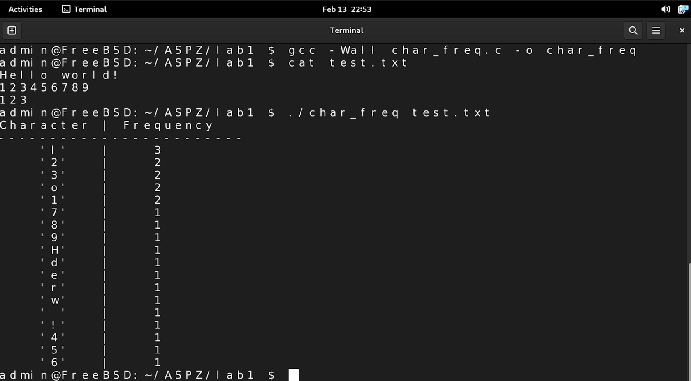

# Практична робота №1
# Варіант 19

Реалізуйте програму, яка зчитує з файлу текст та визначає частоту кожного символу. Виведіть символи у порядку спадання їх частоти.

## Вимоги

- C компілятор (GCC).
- Текстовий файл який подається на вхід у програму.

## Компіляція

```
gcc -Wall char_freq.c -o char_freq
```

## Виконання

```
./char_freq <file_path>
```

